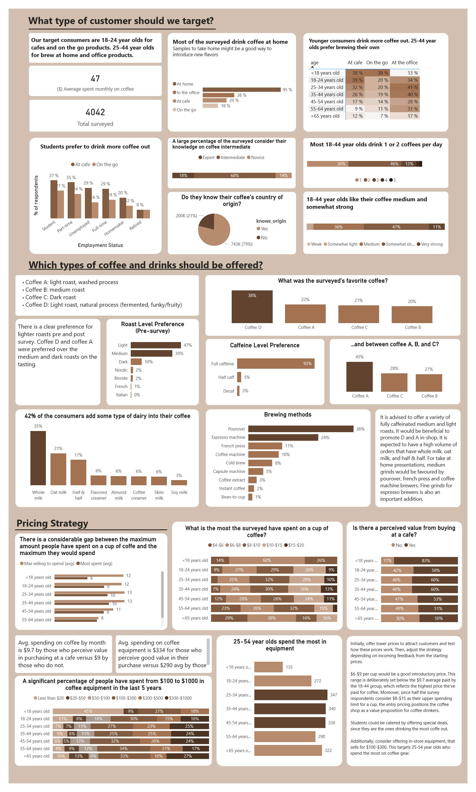

# Maven Coffee Challenge Analysis

## Project Overview

For the Maven Coffee Challenge, I served as an Analytics Consultant tasked with deriving actionable insights for a group of investors entering the US coffee market. My analysis focused on understanding consumer preferences and spending behaviors derived from a comprehensive survey conducted during ["The Great American Coffee Taste Test."](https://www.youtube.com/watch?v=bMOOQfeloH0)

### Data and Tools
The dataset comprised approximately 4,000 responses from Americans who participated in a blind coffee tasting. To manage and analyze this data, I used Power BI. Significant steps included:

Data Cleaning: Using Power Query to unpivot columns and standardize data formats.
In-program calculations: Finding average values and creating new columns to granularize the data and better understand spending patterns and preferences.

### Key Insights and Strategy Recommendations

1. Target Audience
 * Demographics: <18-24 year olds emerged as the most active coffee consumers, particularly favoring coffee consumption at cafes and on the go. On the other hand, 25-44 favor brewing their own coffe at home or at the office.
* Preferences: There is a notable preference for medium and light roast coffees, with fully caffeinated options being overwhelmingly popular. Medium and somewhat strong coffee taste is also sought after.

2. Product Offering
  * Given the preference trends, I recommended focusing on medium and light roast coffees. The popularity of specific brew methods among our target demographic suggested offering products tailored for pourover, French press, and espresso machine use.
  * Additionally, selling coffee equipment targeting the 25-54 age group could capitalize on their higher spending on coffee gear, enhancing overall revenue.

3. Pricing Strategy
  * A competitive initial pricing strategy of $6-$9 per cup was proposed, aimed at attracting a broad customer base without undercutting perceived value. This pricing is strategically set below the highest average previously paid ($9.7) yet within the upper spending limits observed in the survey ($8-$15).
  * Special pricing promotions, particularly for students, were recommended to leverage their higher frequency of coffee consumption outside.
  * Offering $100-$300 coffe gear could be a good starting point to probe the equipment demand. This price point is set below the average of $345 spent on coffee gear, targeting the largest segment that typically spends less.

